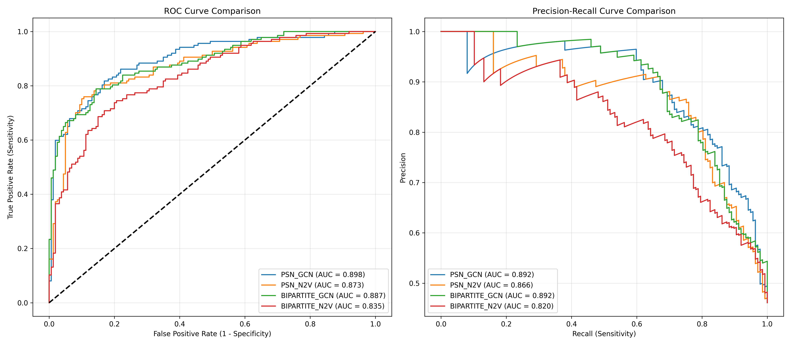
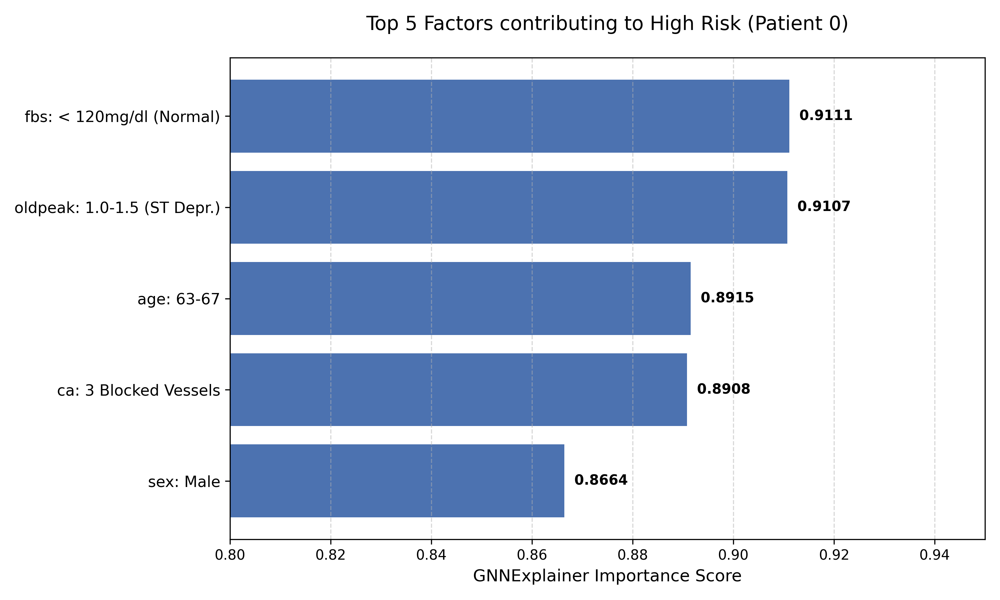

# Heart Disease Risk Prediction via Bipartite Graph Neural Networks

> **Course project** — BMI/CS 775 Computational Network Biology, University of Wisconsin–Madison (Dec 2025)
> **Author:** Avyakt Garg · Supervised by Prof. Anthony Gitter & Prof. Sushmita Roy

---

## Try the Live App

[](https://ag-agent47-heart-disease-gnn-streamlit-app.streamlit.app)

Enter your clinical metrics (age, cholesterol, ECG, etc.) and get an instant heart disease risk assessment from a Graph Neural Network trained on real patient data.

📄 [Read the full research report](./report.pdf)

---

## What This Project Does

Traditional ML treats patients as independent rows in a table. This project asks: *what if we model the relationships between patients and their clinical features as a graph?*

We implemented and compared **four graph-based pipelines** for binary heart disease prediction on the [UCI Cleveland dataset](https://archive.ics.uci.edu/dataset/45/heart+disease) (297 patients, 13 features):

| Graph | Learning Algorithm | Key Idea |
|---|---|---|
| Patient Similarity Network (PSN) | **GraphSAGE** | Patients connected to their *k* most similar neighbors via Gower distance |
| Patient Similarity Network (PSN) | Node2Vec + XGBoost | Same graph, but with unsupervised random-walk embeddings |
| **Bipartite Patient-Attribute** | **GraphSAGE** | Patients connect to shared *attribute nodes* (binned clinical features) |
| Bipartite Patient-Attribute | Node2Vec + XGBoost | Same bipartite graph, unsupervised embeddings |

All four were evaluated under **strict 10-fold nested cross-validation** (5-fold inner tuning) to prevent data leakage — motivated by prior literature showing inflated metrics on this dataset.

---

## Results

### Performance Comparison (threshold = 0.35, optimised for clinical sensitivity)

| Model | AUC-PR | Recall | Specificity | F1 | Accuracy | AUC-ROC |
|---|---|---|---|---|---|---|
| **PSN + GraphSAGE** | 0.907 | **0.860** | 0.812 | **0.827** | **0.835** | **0.913** |
| PSN + Node2Vec | 0.877 | 0.802 | **0.819** | 0.797 | 0.811 | 0.880 |
| **Bipartite + GraphSAGE** | **0.908** | 0.824 | 0.781 | 0.793 | 0.801 | 0.910 |
| Bipartite + Node2Vec | 0.849 | 0.802 | 0.781 | 0.777 | 0.791 | 0.871 |

**Bold = best in column.**

- **PSN + GraphSAGE** achieves the highest recall (0.860), F1 (0.827), accuracy (0.835), and AUC-ROC (0.913) — marginally outperforming the bipartite variant on raw numbers.
- **Bipartite + GraphSAGE** achieves the highest AUC-PR (0.908) and is nearly tied, while offering far superior clinical interpretability (see below).
- Both GCN-based models beat Node2Vec across all or nearly all metrics, confirming end-to-end supervised graph learning outperforms static embeddings here.
- Our best result (83.5% accuracy) strictly surpasses the rigorous SVM benchmark of 83.3% by Padilla Rodriguez et al. (2024) on the same Cleveland dataset.

### ROC & Precision-Recall Curves



GCN-based models (blue/green) consistently enclose the Node2Vec baselines (orange/red). The "staircase" pattern in the PR curves is a known visual artifact of small test folds (~30 patients per fold) — not a model instability.

---

## Key Findings & Conclusions

### 1. Graph topology: accuracy vs. explainability trade-off

PSN achieved marginally higher recall by capturing latent phenotypic clusters through direct patient-to-patient edges. However, it is a **black box** — a prediction driven by "similarity to Patient 35" gives a clinician no actionable insight.

The **Bipartite graph** sacrifices a few percentage points of recall but gains something more valuable: **feature-level explainability**. Via GNNExplainer, we can trace exactly which clinical attribute nodes drove a high-risk prediction.

### 2. GNNExplainer validates clinical knowledge

For a representative high-risk patient, the top contributing attribute nodes were:

- **ST Depression (Oldpeak)** — a definitive ECG marker for coronary artery disease
- **Major Vessels Colored (ca)** — fluoroscopy-based structural indicator
- **Age: 63–67** and **Sex: Male** — established epidemiological baselines
- **Fasting Blood Sugar: Normal** — identified as a high-degree hub facilitating message passing (a graph-structural artefact, not a medical signal)

This mix of genuine clinical risk factors and one graph-structural artefact illustrates both the power and the current limitations of bipartite GNN explanations.



### 3. Inductive inference enables real-time deployment

Unlike transductive GNNs that require re-training to accommodate new patients, **GraphSAGE is inductive**: it generates embeddings for new nodes by aggregating neighbor features. This allows a new patient to be added to the bipartite graph at inference time — O(1) per query — making a real-time web app feasible.

### 4. Benchmark context

Previous GNN studies on this dataset (e.g., Wajgi et al., 2024: 92% accuracy) used aggregated multi-cohort data and standard train-test splits. Our stricter methodology — single Cleveland cohort, nested CV — yields more conservative but more **generalizable** estimates.

---

## Project Structure

```
heart-disease-gnn/
├── streamlit_app.py          # Streamlit Cloud entry point (standalone inference)
├── models.py                 # InductiveGCN (2-layer GraphSAGE)
├── inference.py              # Bipartite graph expansion + GCN inference engine
├── config.py                 # Hyperparameters and dataset paths
├── data_utils.py             # PSN & Bipartite graph builders, data loading
├── requirements.txt          # Streamlit Cloud dependencies
├── report.pdf                # Full research report
│
├── artifacts/
│   ├── best_bipartite_model.pth   # Trained GraphSAGE weights (Bipartite, fold 1)
│   ├── test_graph_data.pt         # Reference graph for inductive inference
│   └── node_mapping.pkl           # Attribute node ID → label mapping
│
├── data/
│   └── processed.cleveland.data   # UCI Cleveland dataset (297 patients)
│
├── plots/
│   ├── model_comparison_curves.png
│   ├── plot_roc_curve.png
│   ├── plot_pr_curve.png
│   ├── plot_confusion_matrix.png
│   ├── plot_learning_curve.png
│   ├── plot_bipartite_structure.png
│   ├── plot_psn_structure.png
│   └── feature_importance.png
│
└── training/                 # Full training pipeline (run locally)
    ├── main.py               # Nested CV training + model comparison
    ├── app.py                # FastAPI backend for local deployment
    ├── frontend.py           # Streamlit frontend for use with FastAPI backend
    └── visualization.py      # ROC/PR/comparison plot generation
```

---

## Run the Streamlit App Locally

```bash
git clone https://github.com/AG-AGENT47/heart-disease-gnn
cd heart-disease-gnn
pip install -r requirements.txt
streamlit run streamlit_app.py
```

## Run the Full Training Pipeline

Requires additional packages (Node2Vec, XGBoost, FastAPI):

```bash
pip install node2vec xgboost fastapi uvicorn networkx torch-scatter torch-sparse torch-cluster
python training/main.py
```

This runs 10-fold nested CV and saves the best Bipartite GCN weights to `artifacts/`.

---

## Architecture

**Bipartite graph construction:**
- Continuous features (age, BP, cholesterol, heart rate, ST depression) → binned into 5 ranges → one attribute node per bin
- Categorical features (sex, chest pain type, ECG, etc.) → one attribute node per category
- Patient ↔ attribute edges are bidirectional

**GraphSAGE model:**
- 2× SAGEConv layers (hidden dim 16), ReLU + dropout
- Linear head → Log-Softmax for binary classification
- Trained with NLLLoss + Adam, early stopping (patience=15)
- Decision threshold: 0.35 (optimised for recall in a screening context)

**Inductive inference:**
- New patient added as a node to the saved reference graph
- Edges drawn to matching attribute nodes from feature values
- GNN forward pass; only the new patient's logit is read out

---

## Disclaimer

This is a research prototype submitted for a course project. It is **not validated for clinical use**.
